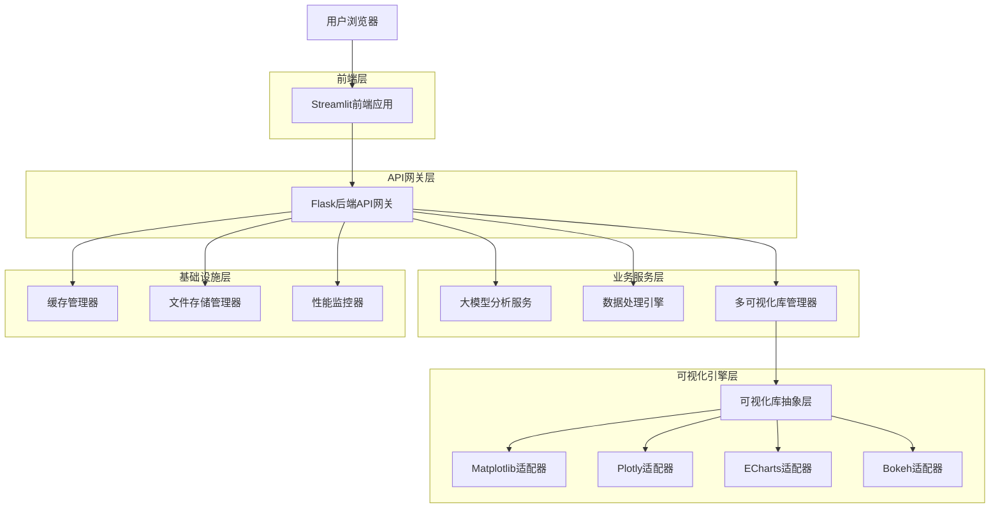
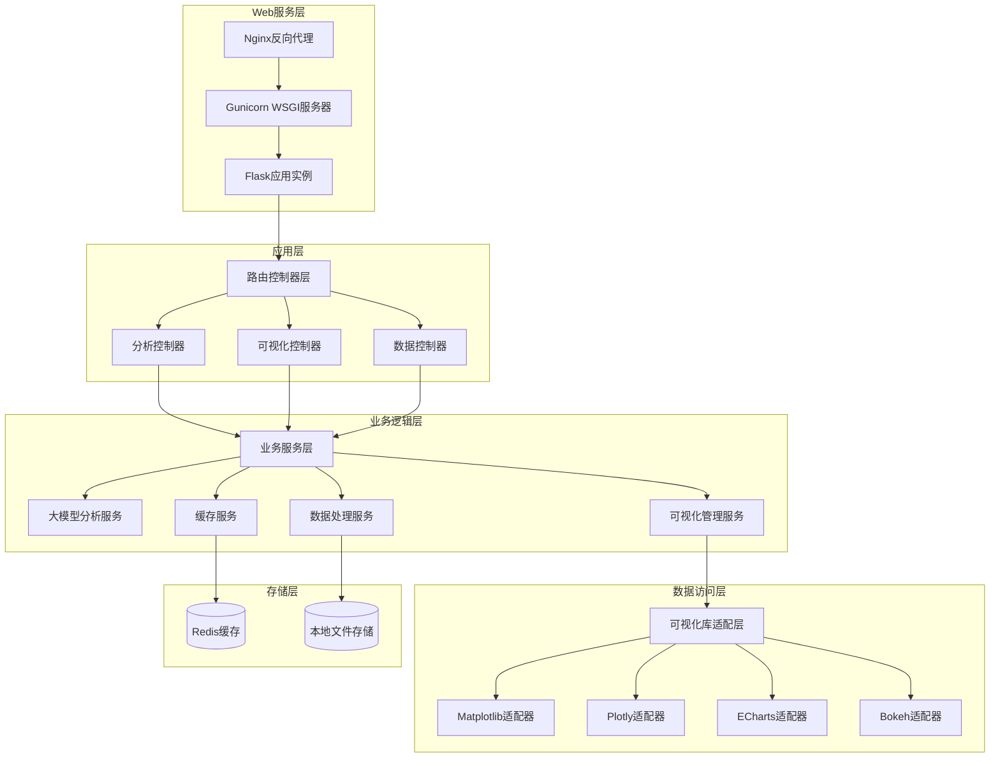
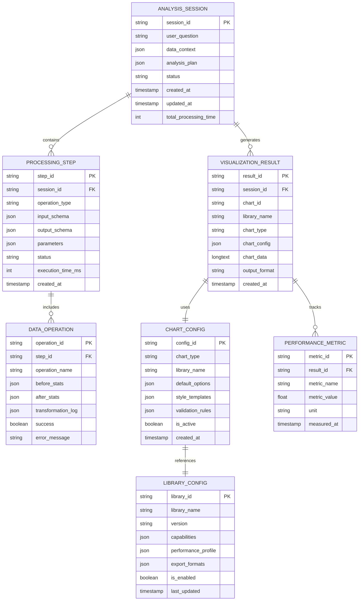

# 多可视化库技术架构文档

## 1. 架构设计



## 2. 技术描述

- **前端**: Streamlit + 自定义HTML/CSS/JavaScript组件
- **后端**: Flask + Python 3.8+ + Gunicorn
- **可视化库**:
  - Matplotlib 3.7+ (静态图表，PNG/SVG输出)
  - Plotly 5.15+ (交互式图表，HTML/JSON输出)
  - Apache ECharts 5.4+ (Web原生图表，JSON配置)
  - Bokeh 3.2+ (大数据可视化，HTML/JSON输出)
- **数据处理**: Pandas 2.0+ + NumPy 1.24+ + Scikit-learn 1.3+
- **大模型**: OpenAI GPT-4 API / 本地LLM (Ollama)
- **缓存**: Redis 7.0+ (图表缓存、会话存储)
- **存储**: 本地文件系统 (上传文件、导出结果)
- **监控**: 自定义性能监控 + 日志系统

## 3. 路由定义

| 路由 | 用途 |
|------|------|
| / | 主页，数据上传和项目概览 |
| /upload | 数据上传页面，支持多格式文件上传 |
| /analysis | 智能分析页面，自然语言问题分析 |
| /visualization | 可视化配置页面，多库选择和图表配置 |
| /results | 结果展示页面，多库渲染结果对比 |
| /history | 历史记录页面，分析历史和性能统计 |
| /settings | 系统设置页面，库配置和性能调优 |

## 4. API定义

### 4.1 核心分析API

**智能问题分析**
```
POST /api/analysis/question
```

请求参数：
| 参数名 | 参数类型 | 是否必需 | 描述 |
|--------|----------|----------|------|
| question | string | true | 用户自然语言问题 |
| data_context | object | true | 数据上下文（列名、类型、统计信息） |
| analysis_history | array | false | 历史分析记录 |
| preferred_libraries | array | false | 用户偏好的可视化库 |

响应参数：
| 参数名 | 参数类型 | 描述 |
|--------|----------|------|
| analysis_id | string | 分析会话ID |
| analysis_steps | array | 数据处理步骤列表 |
| visualization_plan | object | 可视化方案建议 |
| estimated_time | number | 预估处理时间（秒） |

示例请求：
```json
{
  "question": "分析销售额和利润的关系，并展示趋势变化",
  "data_context": {
    "columns": ["date", "sales", "profit", "category"],
    "dtypes": {"date": "datetime", "sales": "float64", "profit": "float64", "category": "object"},
    "shape": [1000, 4],
    "missing_values": {"sales": 5, "profit": 3}
  },
  "preferred_libraries": ["echarts", "plotly"]
}
```

示例响应：
```json
{
  "analysis_id": "analysis_123456",
  "analysis_steps": [
    {
      "step_id": "step_1",
      "operation": "data_cleaning",
      "description": "处理缺失值和异常值",
      "parameters": {"method": "interpolation"}
    },
    {
      "step_id": "step_2",
      "operation": "correlation_analysis",
      "description": "计算销售额和利润的相关性",
      "parameters": {"method": "pearson"}
    }
  ],
  "visualization_plan": {
    "primary_chart": {
      "type": "scatter",
      "libraries": ["echarts", "plotly"],
      "columns": ["sales", "profit"]
    },
    "secondary_chart": {
      "type": "line",
      "libraries": ["echarts", "plotly"],
      "columns": ["date", "sales", "profit"]
    }
  },
  "estimated_time": 15
}
```

**数据处理执行**
```
POST /api/processing/execute
```

请求参数：
| 参数名 | 参数类型 | 是否必需 | 描述 |
|--------|----------|----------|------|
| analysis_id | string | true | 分析会话ID |
| data | array | true | 原始数据 |
| processing_steps | array | true | 处理步骤配置 |

响应参数：
| 参数名 | 参数类型 | 描述 |
|--------|----------|------|
| processed_data | array | 处理后的数据 |
| processing_summary | object | 处理结果摘要 |
| insights | array | 数据洞察列表 |

### 4.2 多库可视化API

**多库图表生成**
```
POST /api/visualization/multi_generate
```

请求参数：
| 参数名 | 参数类型 | 是否必需 | 描述 |
|--------|----------|----------|------|
| analysis_id | string | true | 分析会话ID |
| data | array | true | 处理后的数据 |
| chart_configs | array | true | 多个图表配置 |
| libraries | array | true | 要使用的可视化库列表 |
| comparison_mode | boolean | false | 是否启用对比模式 |

响应参数：
| 参数名 | 参数类型 | 描述 |
|--------|----------|------|
| results | object | 各库的渲染结果 |
| performance_comparison | object | 性能对比数据 |
| recommendations | array | 库选择建议 |

示例请求：
```json
{
  "analysis_id": "analysis_123456",
  "data": [...],
  "chart_configs": [
    {
      "chart_id": "chart_1",
      "type": "scatter",
      "title": "销售额与利润关系图",
      "x_column": "sales",
      "y_column": "profit",
      "color_column": "category"
    }
  ],
  "libraries": ["echarts", "plotly", "bokeh"],
  "comparison_mode": true
}
```

示例响应：
```json
{
  "results": {
    "echarts": {
      "chart_1": {
        "type": "json",
        "data": {
          "option": {
            "title": {"text": "销售额与利润关系图"},
            "xAxis": {"type": "value", "name": "销售额"},
            "yAxis": {"type": "value", "name": "利润"},
            "series": [{
              "type": "scatter",
              "data": [[100, 20], [200, 35], ...]
            }]
          }
        },
        "render_time": 120,
        "file_size": 15360
      }
    },
    "plotly": {
      "chart_1": {
        "type": "html",
        "data": "<div id='plotly-chart'>...</div>",
        "render_time": 180,
        "file_size": 25600
      }
    },
    "bokeh": {
      "chart_1": {
        "type": "html",
        "data": "<script>...</script>",
        "render_time": 250,
        "file_size": 35840
      }
    }
  },
  "performance_comparison": {
    "fastest_render": "echarts",
    "smallest_size": "echarts",
    "most_interactive": "plotly",
    "best_for_large_data": "bokeh"
  },
  "recommendations": [
    {
      "library": "echarts",
      "score": 9.2,
      "reasons": ["渲染速度快", "文件体积小", "适合Web展示"]
    },
    {
      "library": "plotly",
      "score": 8.8,
      "reasons": ["交互性强", "图表美观", "导出方便"]
    }
  ]
}
```

**图表导出**
```
POST /api/visualization/export
```

请求参数：
| 参数名 | 参数类型 | 是否必需 | 描述 |
|--------|----------|----------|------|
| chart_id | string | true | 图表ID |
| library | string | true | 可视化库名称 |
| format | string | true | 导出格式（png/svg/html/pdf/json） |
| options | object | false | 导出选项（尺寸、质量等） |

响应参数：
| 参数名 | 参数类型 | 描述 |
|--------|----------|------|
| download_url | string | 下载链接 |
| file_size | number | 文件大小（字节） |
| expires_at | string | 链接过期时间 |

## 5. 服务器架构图



## 6. 数据模型

### 6.1 数据模型定义



### 6.2 数据定义语言

**分析会话表**
```sql
CREATE TABLE analysis_sessions (
    session_id VARCHAR(36) PRIMARY KEY DEFAULT (UUID()),
    user_question TEXT NOT NULL,
    data_context JSON,
    analysis_plan JSON,
    status ENUM('pending', 'processing', 'completed', 'failed') DEFAULT 'pending',
    created_at TIMESTAMP DEFAULT CURRENT_TIMESTAMP,
    updated_at TIMESTAMP DEFAULT CURRENT_TIMESTAMP ON UPDATE CURRENT_TIMESTAMP,
    total_processing_time INT DEFAULT 0
);

CREATE INDEX idx_sessions_status ON analysis_sessions(status);
CREATE INDEX idx_sessions_created_at ON analysis_sessions(created_at DESC);
```

**处理步骤表**
```sql
CREATE TABLE processing_steps (
    step_id VARCHAR(36) PRIMARY KEY DEFAULT (UUID()),
    session_id VARCHAR(36) NOT NULL,
    operation_type VARCHAR(50) NOT NULL,
    input_schema JSON,
    output_schema JSON,
    parameters JSON,
    status ENUM('pending', 'running', 'completed', 'failed') DEFAULT 'pending',
    execution_time_ms INT DEFAULT 0,
    created_at TIMESTAMP DEFAULT CURRENT_TIMESTAMP,
    FOREIGN KEY (session_id) REFERENCES analysis_sessions(session_id) ON DELETE CASCADE
);

CREATE INDEX idx_steps_session_id ON processing_steps(session_id);
CREATE INDEX idx_steps_status ON processing_steps(status);
```

**可视化结果表**
```sql
CREATE TABLE visualization_results (
    result_id VARCHAR(36) PRIMARY KEY DEFAULT (UUID()),
    session_id VARCHAR(36) NOT NULL,
    chart_id VARCHAR(50) NOT NULL,
    library_name VARCHAR(20) NOT NULL,
    chart_type VARCHAR(50) NOT NULL,
    chart_config JSON,
    chart_data LONGTEXT,
    output_format VARCHAR(10) NOT NULL,
    created_at TIMESTAMP DEFAULT CURRENT_TIMESTAMP,
    FOREIGN KEY (session_id) REFERENCES analysis_sessions(session_id) ON DELETE CASCADE
);

CREATE INDEX idx_results_session_id ON visualization_results(session_id);
CREATE INDEX idx_results_library ON visualization_results(library_name);
CREATE INDEX idx_results_chart_type ON visualization_results(chart_type);
```

**性能指标表**
```sql
CREATE TABLE performance_metrics (
    metric_id VARCHAR(36) PRIMARY KEY DEFAULT (UUID()),
    result_id VARCHAR(36) NOT NULL,
    metric_name VARCHAR(50) NOT NULL,
    metric_value FLOAT NOT NULL,
    unit VARCHAR(20),
    measured_at TIMESTAMP DEFAULT CURRENT_TIMESTAMP,
    FOREIGN KEY (result_id) REFERENCES visualization_results(result_id) ON DELETE CASCADE
);

CREATE INDEX idx_metrics_result_id ON performance_metrics(result_id);
CREATE INDEX idx_metrics_name ON performance_metrics(metric_name);
```

**图表配置表**
```sql
CREATE TABLE chart_configs (
    config_id VARCHAR(36) PRIMARY KEY DEFAULT (UUID()),
    chart_type VARCHAR(50) NOT NULL,
    library_name VARCHAR(20) NOT NULL,
    default_options JSON,
    style_templates JSON,
    validation_rules JSON,
    is_active BOOLEAN DEFAULT TRUE,
    created_at TIMESTAMP DEFAULT CURRENT_TIMESTAMP,
    UNIQUE KEY uk_chart_library (chart_type, library_name)
);

CREATE INDEX idx_configs_chart_type ON chart_configs(chart_type);
CREATE INDEX idx_configs_library ON chart_configs(library_name);
```

**可视化库配置表**
```sql
CREATE TABLE library_configs (
    library_id VARCHAR(36) PRIMARY KEY DEFAULT (UUID()),
    library_name VARCHAR(20) UNIQUE NOT NULL,
    version VARCHAR(20) NOT NULL,
    capabilities JSON,
    performance_profile JSON,
    export_formats JSON,
    is_enabled BOOLEAN DEFAULT TRUE,
    last_updated TIMESTAMP DEFAULT CURRENT_TIMESTAMP ON UPDATE CURRENT_TIMESTAMP
);

-- 初始化可视化库配置
INSERT INTO library_configs (library_name, version, capabilities, performance_profile, export_formats) VALUES
('matplotlib', '3.7.0', 
 '{"chart_types": ["line", "bar", "scatter", "histogram", "pie", "box", "heatmap"], "max_data_points": 100000, "3d_support": true}',
 '{"render_speed": "medium", "memory_usage": "low", "file_size": "small"}',
 '["png", "svg", "pdf", "eps"]'),
('plotly', '5.15.0',
 '{"chart_types": ["line", "bar", "scatter", "histogram", "pie", "box", "heatmap", "3d_scatter", "surface"], "max_data_points": 1000000, "interactive": true}',
 '{"render_speed": "fast", "memory_usage": "medium", "file_size": "medium"}',
 '["html", "png", "svg", "pdf", "json"]'),
('echarts', '5.4.0',
 '{"chart_types": ["line", "bar", "scatter", "pie", "radar", "funnel", "gauge", "treemap"], "max_data_points": 10000000, "web_optimized": true}',
 '{"render_speed": "very_fast", "memory_usage": "low", "file_size": "very_small"}',
 '["png", "svg", "json", "html"]'),
('bokeh', '3.2.0',
 '{"chart_types": ["line", "bar", "scatter", "histogram", "heatmap", "contour"], "max_data_points": 50000000, "big_data_optimized": true}',
 '{"render_speed": "slow", "memory_usage": "high", "file_size": "large"}',
 '["html", "png", "svg"]');
```

## 7. 核心组件实现

### 7.1 可视化库抽象层

**基础抽象类**
```python
from abc import ABC, abstractmethod
from typing import Dict, List, Any, Optional, Union
import pandas as pd

class BaseVisualizationAdapter(ABC):
    """可视化库适配器基类"""
    
    def __init__(self, config: Dict[str, Any]):
        self.config = config
        self.library_name = self.get_library_name()
        self.supported_charts = self.get_supported_charts()
    
    @abstractmethod
    def get_library_name(self) -> str:
        """返回库名称"""
        pass
    
    @abstractmethod
    def get_supported_charts(self) -> List[str]:
        """返回支持的图表类型"""
        pass
    
    @abstractmethod
    def generate_chart(self, data: pd.DataFrame, chart_config: Dict) -> Dict:
        """生成图表"""
        pass
    
    @abstractmethod
    def export_chart(self, chart_data: Any, format: str, options: Dict) -> bytes:
        """导出图表"""
        pass
    
    def validate_config(self, chart_config: Dict) -> bool:
        """验证图表配置"""
        required_fields = ['chart_type', 'title']
        return all(field in chart_config for field in required_fields)
    
    def get_performance_metrics(self) -> Dict:
        """获取性能指标"""
        return {
            'render_time': 0,
            'memory_usage': 0,
            'file_size': 0
        }
```

### 7.2 ECharts适配器实现

```python
import json
import time
from typing import Dict, List, Any
import pandas as pd

class EChartsAdapter(BaseVisualizationAdapter):
    """Apache ECharts适配器"""
    
    def get_library_name(self) -> str:
        return 'echarts'
    
    def get_supported_charts(self) -> List[str]:
        return ['line', 'bar', 'scatter', 'pie', 'radar', 'funnel', 'gauge', 'treemap', 'heatmap']
    
    def generate_chart(self, data: pd.DataFrame, chart_config: Dict) -> Dict:
        """生成ECharts配置"""
        start_time = time.time()
        
        chart_type = chart_config['chart_type']
        title = chart_config.get('title', '图表')
        
        # 根据图表类型生成对应的ECharts配置
        if chart_type == 'line':
            option = self._generate_line_chart(data, chart_config)
        elif chart_type == 'bar':
            option = self._generate_bar_chart(data, chart_config)
        elif chart_type == 'scatter':
            option = self._generate_scatter_chart(data, chart_config)
        elif chart_type == 'pie':
            option = self._generate_pie_chart(data, chart_config)
        else:
            raise ValueError(f"不支持的图表类型: {chart_type}")
        
        render_time = (time.time() - start_time) * 1000
        
        return {
            'type': 'json',
            'data': {'option': option},
            'render_time': render_time,
            'file_size': len(json.dumps(option).encode('utf-8'))
        }
    
    def _generate_line_chart(self, data: pd.DataFrame, config: Dict) -> Dict:
        """生成折线图配置"""
        x_col = config['x_column']
        y_cols = config.get('y_columns', [config.get('y_column')])
        
        option = {
            'title': {'text': config.get('title', '折线图')},
            'tooltip': {'trigger': 'axis'},
            'legend': {'data': y_cols},
            'xAxis': {
                'type': 'category',
                'data': data[x_col].tolist()
            },
            'yAxis': {'type': 'value'},
            'series': []
        }
        
        for y_col in y_cols:
            option['series'].append({
                'name': y_col,
                'type': 'line',
                'data': data[y_col].tolist()
            })
        
        return option
    
    def _generate_scatter_chart(self, data: pd.DataFrame, config: Dict) -> Dict:
        """生成散点图配置"""
        x_col = config['x_column']
        y_col = config['y_column']
        color_col = config.get('color_column')
        
        scatter_data = []
        for _, row in data.iterrows():
            point = [row[x_col], row[y_col]]
            if color_col:
                point.append(row[color_col])
            scatter_data.append(point)
        
        option = {
            'title': {'text': config.get('title', '散点图')},
            'tooltip': {'trigger': 'item'},
            'xAxis': {'type': 'value', 'name': x_col},
            'yAxis': {'type': 'value', 'name': y_col},
            'series': [{
                'type': 'scatter',
                'data': scatter_data,
                'symbolSize': config.get('symbol_size', 8)
            }]
        }
        
        return option
    
    def export_chart(self, chart_data: Any, format: str, options: Dict) -> bytes:
        """导出ECharts图表"""
        if format == 'json':
            return json.dumps(chart_data['option'], ensure_ascii=False, indent=2).encode('utf-8')
        elif format == 'html':
            html_template = f"""
            <!DOCTYPE html>
            <html>
            <head>
                <script src="https://cdn.jsdelivr.net/npm/echarts@5.4.0/dist/echarts.min.js"></script>
            </head>
            <body>
                <div id="chart" style="width: {options.get('width', 800)}px; height: {options.get('height', 600)}px;"></div>
                <script>
                    var chart = echarts.init(document.getElementById('chart'));
                    var option = {json.dumps(chart_data['option'])};
                    chart.setOption(option);
                </script>
            </body>
            </html>
            """
            return html_template.encode('utf-8')
        else:
            raise ValueError(f"不支持的导出格式: {format}")
```

### 7.3 Bokeh适配器实现

```python
import json
import time
from typing import Dict, List, Any
import pandas as pd
from bokeh.plotting import figure
from bokeh.embed import json_item
from bokeh.models import HoverTool
from bokeh.io import export_png, export_svgs

class BokehAdapter(BaseVisualizationAdapter):
    """Bokeh适配器"""
    
    def get_library_name(self) -> str:
        return 'bokeh'
    
    def get_supported_charts(self) -> List[str]:
        return ['line', 'bar', 'scatter', 'histogram', 'heatmap', 'contour']
    
    def generate_chart(self, data: pd.DataFrame, chart_config: Dict) -> Dict:
        """生成Bokeh图表"""
        start_time = time.time()
        
        chart_type = chart_config['chart_type']
        
        # 创建基础图表对象
        p = figure(
            title=chart_config.get('title', '图表'),
            width=chart_config.get('width', 600),
            height=chart_config.get('height', 400),
            tools="pan,wheel_zoom,box_zoom,reset,save"
        )
        
        # 根据图表类型添加数据
        if chart_type == 'line':
            self._add_line_chart(p, data, chart_config)
        elif chart_type == 'scatter':
            self._add_scatter_chart(p, data, chart_config)
        elif chart_type == 'bar':
            self._add_bar_chart(p, data, chart_config)
        else:
            raise ValueError(f"不支持的图表类型: {chart_type}")
        
        # 转换为JSON格式
        chart_json = json_item(p)
        render_time = (time.time() - start_time) * 1000
        
        return {
            'type': 'json',
            'data': chart_json,
            'render_time': render_time,
            'file_size': len(json.dumps(chart_json).encode('utf-8'))
        }
    
    def _add_line_chart(self, p, data: pd.DataFrame, config: Dict):
        """添加折线图"""
        x_col = config['x_column']
        y_col = config['y_column']
        
        p.line(data[x_col], data[y_col], 
               line_width=config.get('line_width', 2),
               color=config.get('color', 'blue'),
               legend_label=y_col)
        
        # 添加悬停工具
        hover = HoverTool(tooltips=[(x_col, '@x'), (y_col, '@y')])
        p.add_tools(hover)
    
    def _add_scatter_chart(self, p, data: pd.DataFrame, config: Dict):
        """添加散点图"""
        x_col = config['x_column']
        y_col = config['y_column']
        
        p.scatter(data[x_col], data[y_col],
                 size=config.get('size', 8),
                 color=config.get('color', 'blue'),
                 alpha=config.get('alpha', 0.7))
        
        # 设置轴标签
        p.xaxis.axis_label = x_col
        p.yaxis.axis_label = y_col
    
    def export_chart(self, chart_data: Any, format: str, options: Dict) -> bytes:
        """导出Bokeh图表"""
        if format == 'json':
            return json.dumps(chart_data, ensure_ascii=False, indent=2).encode('utf-8')
        elif format == 'html':
            # 生成完整的HTML页面
            from bokeh.embed import file_html
            from bokeh.resources import CDN
            from bokeh.plotting import figure
            
            # 重新创建图表对象（简化版）
            p = figure(title="Bokeh Chart")
            html = file_html(p, CDN, "Bokeh Chart")
            return html.encode('utf-8')
        else:
            raise ValueError(f"不支持的导出格式: {format}")
```

### 7.4 多库管理器

```python
from typing import Dict, List, Any, Optional
import pandas as pd
import time
import logging

class MultiVisualizationManager:
    """多可视化库管理器"""
    
    def __init__(self):
        self.adapters = {}
        self.performance_cache = {}
        self.logger = logging.getLogger(__name__)
        
        # 初始化适配器
        self._initialize_adapters()
    
    def _initialize_adapters(self):
        """初始化所有适配器"""
        try:
            from .adapters.matplotlib_adapter import MatplotlibAdapter
            from .adapters.plotly_adapter import PlotlyAdapter
            from .adapters.echarts_adapter import EChartsAdapter
            from .adapters.bokeh_adapter import BokehAdapter
            
            self.adapters['matplotlib'] = MatplotlibAdapter({})
            self.adapters['plotly'] = PlotlyAdapter({})
            self.adapters['echarts'] = EChartsAdapter({})
            self.adapters['bokeh'] = BokehAdapter({})
            
            self.logger.info(f"已初始化 {len(self.adapters)} 个可视化适配器")
        except ImportError as e:
            self.logger.error(f"初始化适配器失败: {e}")
    
    def get_available_libraries(self) -> List[str]:
        """获取可用的可视化库列表"""
        return list(self.adapters.keys())
    
    def get_supported_charts(self, library: str) -> List[str]:
        """获取指定库支持的图表类型"""
        if library not in self.adapters:
            raise ValueError(f"不支持的可视化库: {library}")
        return self.adapters[library].get_supported_charts()
    
    def generate_multi_charts(self, data: pd.DataFrame, 
                            chart_configs: List[Dict],
                            libraries: List[str],
                            comparison_mode: bool = False) -> Dict:
        """生成多库图表"""
        results = {}
        performance_data = {}
        
        for library in libraries:
            if library not in self.adapters:
                self.logger.warning(f"跳过不支持的库: {library}")
                continue
            
            library_results = {}
            library_performance = []
            
            for chart_config in chart_configs:
                try:
                    start_time = time.time()
                    
                    # 生成图表
                    result = self.adapters[library].generate_chart(data, chart_config)
                    
                    # 记录性能数据
                    performance = {
                        'render_time': result.get('render_time', 0),
                        'file_size': result.get('file_size', 0),
                        'memory_usage': self._get_memory_usage()
                    }
                    
                    library_results[chart_config.get('chart_id', f"chart_{len(library_results)}")] = result
                    library_performance.append(performance)
                    
                except Exception as e:
                    self.logger.error(f"生成图表失败 [{library}]: {e}")
                    continue
            
            if library_results:
                results[library] = library_results
                performance_data[library] = library_performance
        
        # 生成性能对比和推荐
        comparison = self._generate_performance_comparison(performance_data) if comparison_mode else {}
        recommendations = self._generate_recommendations(performance_data, chart_configs)
        
        return {
            'results': results,
            'performance_comparison': comparison,
            'recommendations': recommendations
        }
    
    def _generate_performance_comparison(self, performance_data: Dict) -> Dict:
        """生成性能对比数据"""
        if not performance_data:
            return {}
        
        # 计算各库的平均性能
        avg_performance = {}
        for library, metrics_list in performance_data.items():
            if metrics_list:
                avg_performance[library] = {
                    'avg_render_time': sum(m['render_time'] for m in metrics_list) / len(metrics_list),
                    'avg_file_size': sum(m['file_size'] for m in metrics_list) / len(metrics_list),
                    'avg_memory_usage': sum(m['memory_usage'] for m in metrics_list) / len(metrics_list)
                }
        
        # 找出最佳表现
        fastest_render = min(avg_performance.items(), key=lambda x: x[1]['avg_render_time'])[0]
        smallest_size = min(avg_performance.items(), key=lambda x: x[1]['avg_file_size'])[0]
        lowest_memory = min(avg_performance.items(), key=lambda x: x[1]['avg_memory_usage'])[0]
        
        return {
            'fastest_render': fastest_render,
            'smallest_size': smallest_size,
            'lowest_memory': lowest_memory,
            'detailed_metrics': avg_performance
        }
    
    def _generate_recommendations(self, performance_data: Dict, chart_configs: List[Dict]) -> List[Dict]:
        """生成库选择推荐"""
        recommendations = []
        
        # 基于性能数据和图表类型生成推荐
        for library in performance_data.keys():
            score = self._calculate_library_score(library, performance_data[library], chart_configs)
            reasons = self._get_recommendation_reasons(library, performance_data[library])
            
            recommendations.append({
                'library': library,
                'score': score,
                'reasons': reasons
            })
        
        # 按分数排序
        recommendations.sort(key=lambda x: x['score'], reverse=True)
        return recommendations
    
    def _calculate_library_score(self, library: str, performance: List[Dict], configs: List[Dict]) -> float:
        """计算库的推荐分数"""
        base_scores = {
            'matplotlib': 7.0,
            'plotly': 8.5,
            'echarts': 9.0,
            'bokeh': 7.5
        }
        
        score = base_scores.get(library, 5.0)
        
        # 根据性能调整分数
        if performance:
            avg_render_time = sum(p['render_time'] for p in performance) / len(performance)
            avg_file_size = sum(p['file_size'] for p in performance) / len(performance)
            
            # 渲染时间越短分数越高
            if avg_render_time < 100:
                score += 1.0
            elif avg_render_time > 500:
                score -= 1.0
            
            # 文件大小越小分数越高
            if avg_file_size < 10000:
                score += 0.5
            elif avg_file_size > 100000:
                score -= 0.5
        
        return min(10.0, max(0.0, score))
    
    def _get_recommendation_reasons(self, library: str, performance: List[Dict]) -> List[str]:
        """获取推荐理由"""
        reasons = []
        
        library_features = {
            'matplotlib': ['静态图表质量高', '导出格式丰富', '内存使用低'],
            'plotly': ['交互性强', '图表美观', 'Web友好'],
            'echarts': ['渲染速度快', '文件体积小', '适合Web展示'],
            'bokeh': ['大数据支持好', '服务器集成佳', '自定义能力强']
        }
        
        reasons.extend(library_features.get(library, []))
        
        # 根据性能添加动态理由
        if performance:
            avg_render_time = sum(p['render_time'] for p in performance) / len(performance)
            if avg_render_time < 100:
                reasons.append('渲染速度优秀')
        
        return reasons[:3]  # 最多返回3个理由
    
    def _get_memory_usage(self) -> float:
        """获取当前内存使用量（MB）"""
        import psutil
        import os
        
        process = psutil.Process(os.getpid())
        return process.memory_info().rss / 1024 / 1024
```

这个技术架构文档提供了完整的多可视化库集成方案，包括详细的API设计、数据模型、核心组件实现等，为项目的技术实施提供了全面的指导。