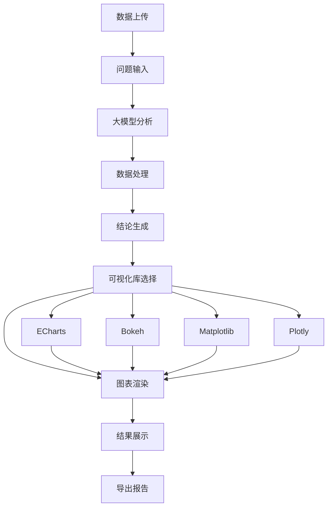
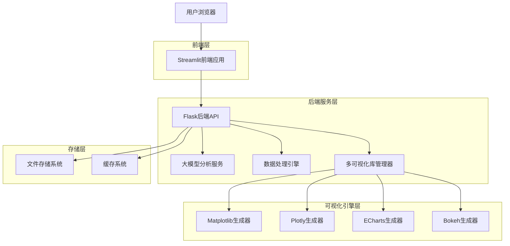
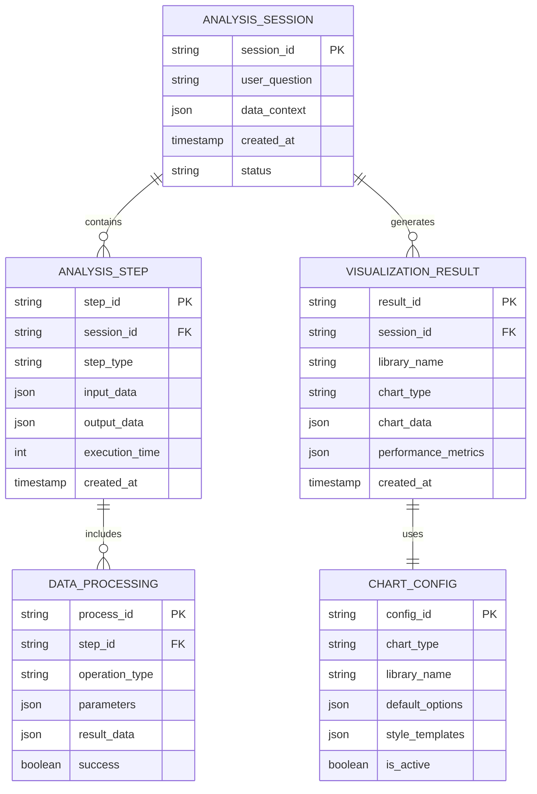

# 多可视化库集成系统设计文档

## 1. 产品概述

本文档描述了JDC数据分析工具的多可视化库集成升级方案，旨在为用户提供Apache ECharts和Bokeh等多种可视化库选择，并重新设计数据分析流程以提升用户体验和分析效果。

该系统将实现：用户提问 → 大模型分析 → 数据处理 → 结论生成 → 多库可视化渲染的完整分析链路，让用户能够根据不同的分析需求选择最适合的可视化库进行数据渲染。

## 2. 核心功能

### 2.1 用户角色

| 角色 | 注册方式 | 核心权限 |
|------|----------|----------|
| 数据分析师 | 直接访问 | 可使用所有可视化库、进行复杂数据分析 |
| 业务用户 | 直接访问 | 可使用基础可视化功能、查看分析报告 |

### 2.2 功能模块

本系统包含以下主要页面：

1. **数据上传页面**：文件上传、数据预览、格式验证
2. **智能分析页面**：问题输入、大模型分析、可视化库选择
3. **可视化配置页面**：库选择器、图表类型配置、样式定制
4. **结果展示页面**：多库渲染结果、交互式图表、导出功能
5. **流程管理页面**：分析历史、流程监控、性能统计

### 2.3 页面详情

| 页面名称 | 模块名称 | 功能描述 |
|----------|----------|----------|
| 数据上传页面 | 文件上传器 | 支持CSV、Excel、JSON格式文件上传，自动数据类型检测 |
| 数据上传页面 | 数据预览器 | 显示数据基本信息、统计摘要、缺失值分析 |
| 智能分析页面 | 问题输入区 | 自然语言问题输入、历史问题推荐、问题模板 |
| 智能分析页面 | 大模型分析器 | 调用LLM分析用户问题、生成分析思路、推荐处理方案 |
| 智能分析页面 | 数据处理器 | 根据分析思路执行数据清洗、转换、计算操作 |
| 可视化配置页面 | 库选择器 | 提供Matplotlib、Plotly、ECharts、Bokeh四种库选择 |
| 可视化配置页面 | 图表配置器 | 图表类型选择、样式定制、交互设置 |
| 可视化配置页面 | 预览器 | 实时预览图表效果、参数调整 |
| 结果展示页面 | 多库渲染器 | 同时展示不同库的渲染结果、性能对比 |
| 结果展示页面 | 交互控制器 | 图表缩放、筛选、钻取等交互功能 |
| 结果展示页面 | 导出管理器 | 支持PNG、SVG、HTML、PDF等格式导出 |
| 流程管理页面 | 历史记录器 | 保存分析历史、支持重新执行、结果对比 |
| 流程管理页面 | 性能监控器 | 监控各库渲染性能、内存使用、响应时间 |

## 3. 核心流程

### 3.1 重新设计的数据分析流程

**主要用户操作流程：**

1. **数据准备阶段**：用户上传数据文件，系统自动解析并展示数据概览
2. **问题分析阶段**：用户输入自然语言问题，大模型分析问题意图并生成解决思路
3. **数据处理阶段**：系统根据分析思路自动执行数据清洗、转换、计算等操作
4. **结论生成阶段**：基于处理后的数据生成分析结论和关键洞察
5. **可视化选择阶段**：用户选择可视化库（ECharts/Bokeh/Matplotlib/Plotly）
6. **图表渲染阶段**：使用选定的库渲染图表，支持多库对比展示
7. **结果导出阶段**：导出图表和分析报告



## 4. 用户界面设计

### 4.1 设计风格

- **主色调**：#2c2c2c（深灰）、#6c757d（中灰）、#f8f9fa（浅灰）
- **强调色**：#007bff（蓝色）、#28a745（绿色）、#ffc107（黄色）
- **按钮风格**：圆角矩形，悬停效果，渐变背景
- **字体**：Microsoft YaHei、SimHei，标题16px，正文14px
- **布局风格**：卡片式布局，左侧导航，响应式设计
- **图标风格**：Material Design风格，支持emoji表情

### 4.2 页面设计概览

| 页面名称 | 模块名称 | UI元素 |
|----------|----------|--------|
| 智能分析页面 | 问题输入区 | 大型文本框、问题模板按钮、历史记录下拉框、提交按钮 |
| 智能分析页面 | 分析结果区 | 思路展示卡片、处理步骤时间线、进度指示器 |
| 可视化配置页面 | 库选择器 | 四个库的选择卡片、特性对比表格、推荐标签 |
| 可视化配置页面 | 图表配置器 | 图表类型网格、样式调色板、参数滑块、预览窗口 |
| 结果展示页面 | 多库对比区 | 并排图表展示、性能指标表、切换标签页 |
| 结果展示页面 | 交互控制区 | 缩放控件、筛选器、导出按钮组 |

### 4.3 响应式设计

系统采用桌面优先的响应式设计，支持平板和移动设备访问。在小屏幕设备上，多库对比将改为垂直堆叠显示，图表配置面板将折叠为抽屉式界面。

## 5. 技术架构设计

### 5.1 整体架构



### 5.2 技术栈描述

- **前端**：Streamlit + HTML/CSS/JavaScript + 自定义组件
- **后端**：Flask + Python 3.8+
- **可视化库**：
  - Matplotlib 3.7+ (静态图表)
  - Plotly 5.15+ (交互式图表)
  - Apache ECharts 5.4+ (Web图表)
  - Bokeh 3.2+ (大数据可视化)
- **大模型**：OpenAI GPT-4 / 本地LLM
- **数据处理**：Pandas + NumPy + Scikit-learn
- **存储**：本地文件系统 + Redis缓存

### 5.3 路由定义

| 路由 | 用途 |
|------|------|
| /upload | 数据上传页面，支持文件上传和预览 |
| /analysis | 智能分析页面，问题输入和大模型分析 |
| /visualization | 可视化配置页面，库选择和图表配置 |
| /results | 结果展示页面，多库渲染结果对比 |
| /history | 历史记录页面，分析历史和性能统计 |

### 5.4 核心API定义

#### 4.1 大模型分析API

**问题分析接口**
```
POST /api/analysis/question
```

请求参数：
| 参数名 | 参数类型 | 是否必需 | 描述 |
|--------|----------|----------|------|
| question | string | true | 用户输入的自然语言问题 |
| data_context | object | true | 数据上下文信息（列名、类型等） |
| history | array | false | 历史分析记录 |

响应参数：
| 参数名 | 参数类型 | 描述 |
|--------|----------|------|
| analysis_result | object | 分析结果对象 |
| processing_steps | array | 数据处理步骤列表 |
| visualization_suggestions | array | 可视化建议列表 |

#### 4.2 多库可视化API

**图表生成接口**
```
POST /api/visualization/generate
```

请求参数：
| 参数名 | 参数类型 | 是否必需 | 描述 |
|--------|----------|----------|------|
| data | array | true | 处理后的数据 |
| chart_config | object | true | 图表配置信息 |
| library | string | true | 可视化库选择（matplotlib/plotly/echarts/bokeh） |
| export_format | string | false | 导出格式（png/svg/html/json） |

响应示例：
```json
{
  "success": true,
  "chart_data": {
    "matplotlib": "data:image/png;base64,iVBOR...",
    "plotly": "<div id='plotly-div'>...</div>",
    "echarts": {"option": {...}, "theme": "default"},
    "bokeh": "<script>...</script>"
  },
  "performance_metrics": {
    "render_time": 150,
    "memory_usage": 25.6,
    "file_size": 1024
  }
}
```

### 5.5 数据模型设计

#### 5.1 数据模型定义



#### 5.2 数据定义语言

**分析会话表 (analysis_sessions)**
```sql
CREATE TABLE analysis_sessions (
    session_id VARCHAR(36) PRIMARY KEY DEFAULT (UUID()),
    user_question TEXT NOT NULL,
    data_context JSON,
    status VARCHAR(20) DEFAULT 'pending',
    created_at TIMESTAMP DEFAULT CURRENT_TIMESTAMP,
    updated_at TIMESTAMP DEFAULT CURRENT_TIMESTAMP ON UPDATE CURRENT_TIMESTAMP
);

CREATE INDEX idx_sessions_created_at ON analysis_sessions(created_at DESC);
CREATE INDEX idx_sessions_status ON analysis_sessions(status);
```

**可视化结果表 (visualization_results)**
```sql
CREATE TABLE visualization_results (
    result_id VARCHAR(36) PRIMARY KEY DEFAULT (UUID()),
    session_id VARCHAR(36) NOT NULL,
    library_name VARCHAR(20) NOT NULL,
    chart_type VARCHAR(50) NOT NULL,
    chart_data LONGTEXT,
    performance_metrics JSON,
    created_at TIMESTAMP DEFAULT CURRENT_TIMESTAMP,
    FOREIGN KEY (session_id) REFERENCES analysis_sessions(session_id)
);

CREATE INDEX idx_results_session_id ON visualization_results(session_id);
CREATE INDEX idx_results_library ON visualization_results(library_name);
```

**图表配置表 (chart_configs)**
```sql
CREATE TABLE chart_configs (
    config_id VARCHAR(36) PRIMARY KEY DEFAULT (UUID()),
    chart_type VARCHAR(50) NOT NULL,
    library_name VARCHAR(20) NOT NULL,
    default_options JSON,
    style_templates JSON,
    is_active BOOLEAN DEFAULT TRUE,
    created_at TIMESTAMP DEFAULT CURRENT_TIMESTAMP
);

-- 初始化数据
INSERT INTO chart_configs (chart_type, library_name, default_options, style_templates) VALUES
('bar', 'echarts', '{"color": ["#5470c6", "#91cc75"], "grid": {"left": "3%", "right": "4%"}}', '{"dark": {"backgroundColor": "#2c2c2c"}, "light": {"backgroundColor": "#ffffff"}}'),
('scatter', 'bokeh', '{"tools": "pan,wheel_zoom,box_zoom,reset,save", "width": 600, "height": 400}', '{"modern": {"background_fill_color": "#fafafa"}}'),
('line', 'plotly', '{"mode": "lines+markers", "line": {"width": 2}}', '{"minimal": {"layout": {"showlegend": false}}}');
```

## 6. 实施计划

### 6.1 开发阶段

**第一阶段（1-2周）：基础架构搭建**
- 创建多可视化库管理器基础框架
- 实现ECharts和Bokeh库的基础集成
- 设计统一的图表配置接口

**第二阶段（2-3周）：核心功能开发**
- 重构大模型分析流程
- 实现数据处理引擎优化
- 开发可视化库选择器界面

**第三阶段（1-2周）：界面优化和集成**
- 完善多库对比展示功能
- 实现性能监控和缓存机制
- 集成导出和历史记录功能

**第四阶段（1周）：测试和部署**
- 进行全面功能测试
- 性能优化和bug修复
- 部署和用户培训

### 6.2 成功指标

- **功能完整性**：支持4种可视化库，覆盖8种以上图表类型
- **性能指标**：图表渲染时间<3秒，内存使用<100MB
- **用户体验**：界面响应时间<1秒，操作流程<5步完成
- **稳定性**：系统可用性>99%，错误率<1%

### 6.3 风险评估

- **技术风险**：不同可视化库API差异较大，需要统一抽象层
- **性能风险**：多库同时渲染可能导致内存压力，需要优化策略
- **兼容性风险**：不同库的导出格式不一致，需要格式转换

### 6.4 后续扩展

- 支持更多可视化库（D3.js、Chart.js等）
- 实现自定义图表模板功能
- 添加协作分享和团队管理功能
- 集成更多数据源（数据库、API等）